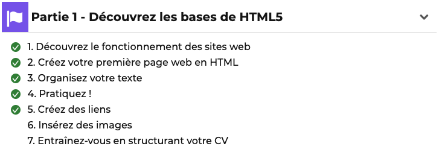

# Entraînez-vous en structurant votre CV

**À vous de jouer !** Pour vous entraîner, réalisez cet exercice étape par étape.

Une fois que vous avez terminé, vous pouvez comparer, autoévaluer, votre
travail avec ma **Liste de contrôle**

## Contexte

Vous cherchez du travail et vous décidez de créer votre CV en ligne.
Pour cela, vous allez devoir créer votre première page HTML.

**Avant de commencer**, je vous conseille de lire les articles suivants : 
* [Partie 1 - Découvrez les bases de HTML5 ](https://openclassrooms.com/fr/courses/1603881-apprenez-a-creer-votre-site-web-avec-html5-et-css3)

* [Créer une page web de base avec HTML & CSS](https://fallinov.medium.com/cr%C3%A9er-un-page-web-de-base-avec-html-css-2c702e069a0c)

## Votre mission

* Étape 1 : Créez un fichier `index.html`.
* Étape 2 : Ajoutez votre nom et votre prénom au titre principal.
* Étape 3 : Ajoutez une photo miniature, sur laquelle on pourra cliquer pour avoir une version agrandie.
* Étape 4 : Ajoutez trois sections avec un titre secondaire :
  * Mon expérience (vous pouvez en inventer 😅)
  * Mes compétences
  * Ma formation
  * Chaque section contient un paragraphe ou une liste à puce._
* Étape 5 : Créer un fichier `main.css` et ajoutez-y les effets de style CSS
  suivants :
  * changer la couleur d'un des textes ;
  * changer l'alignement d'un des textes ;
  * appliquer une image de fond à la page ;
  * utiliser une police personnalisée via @font-face ;
  * définir la bordure d'un élément ;
  * définir l'ombre d'un élément.

## Check-list

✅ La page HTML est un CV.

✅ On trouve votre nom et prénom dans l'onglet de la page.

✅ L'icône de la page s'affiche dans l'onglet.

✅ Le titre principal est un `<h1>` et contient votre nom et prénom.

✅ Une photo miniature cliquable renvoie sur la même photo agrandie.

✅ Trois sections en titre `<h2>` :
* mon expérience
* mes compétences
* ma formation

✅ Chaque section contient au minimum
un paragraphe ou une liste à puce.

✅ Vous avez un fichier `.html` et un fichier `.css`.

✅ La couleur d’un des textes est changée.

✅ L’alignement d’un des textes est changé.

✅ Une image de fond est appliquée à la page.

✅ Une police personnalisée est utilisée via @font-face.

✅ La bordure d’un élément est définie.

✅ L’ombre d’un élément est définie.

## Exemples de solutions
* https://fallinov.github.io/HTML-CV
* https://static.oc-static.com/activities/199/evaluation_resources/mettez-en-forme-votre-cv_exemple-2019-01-03T082017.zip

## Sources de cet exercice :
* https://openclassrooms.com/fr/courses/1603881-apprenez-a-creer-votre-site-web-avec-html5-et-css3/6725196-entrainez-vous-en-structurant-votre-cv
* https://openclassrooms.com/fr/courses/1603881-apprenez-a-creer-votre-site-web-avec-html5-et-css3/6725256-entrainez-vous-en-mettant-en-forme-votre-cv
